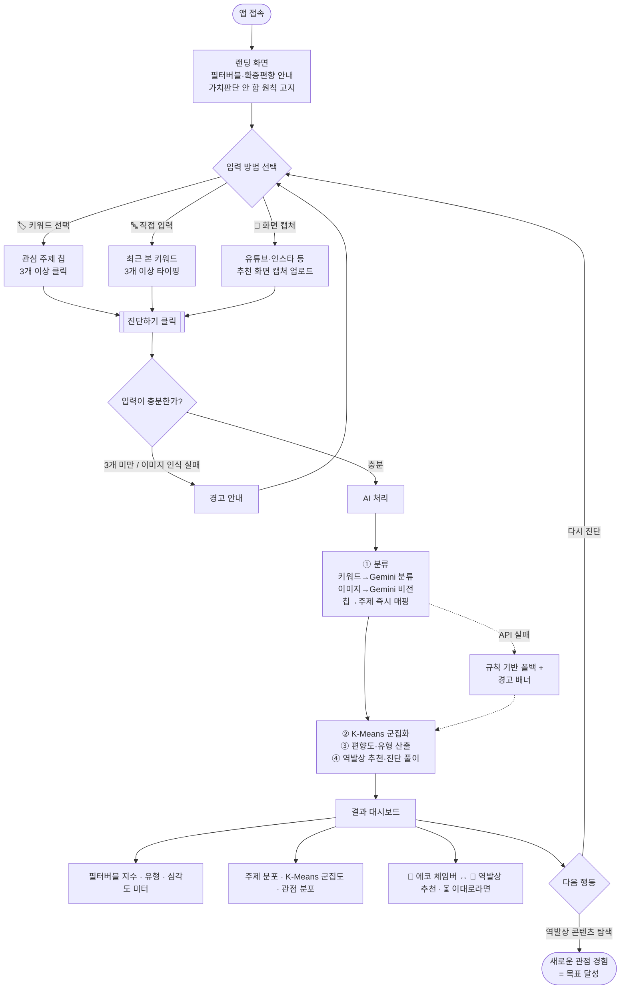

# 사용자 플로우 — 미디어 리터러시 랩 (나의 필터버블 진단)

사용자가 앱에 들어와 자신의 필터버블을 진단하고, 알고리즘 밖의 콘텐츠를 마주하기까지의 흐름.

## 흐름도

## 단계별 상세

| # | 단계 | 사용자 행동 | 시스템 반응 |
| --- | --- | --- | --- |
| 1 | **진입** | 앱 접속 | 랜딩 화면 표시 — 필터버블·확증편향 소개, "옳고 그름을 판단하지 않는다" 원칙 고지 |
| 2 | **입력 방법 선택** | 사이드바에서 3가지 중 택1 | 선택한 방식의 입력 위젯 표시 |
| 2A | · 키워드 선택 | 관심 주제 칩(정치·경제·AI·아이돌·게임 등 12종) 3개+ 클릭 | 선택 칩 강조 |
| 2B | · 직접 입력 | 최근 본 영상·기사 키워드 3줄+ 입력 | — |
| 2C | · 화면 캡처 | 유튜브·인스타 스크린샷 업로드 | 미리보기 표시, "저장 안 함" 안내 |
| 3 | **진단 요청** | `진단하기` 클릭 | 입력 검증 → 3개 미만이면 경고 후 2단계로 복귀 |
| 4 | **AI 처리** | (대기) | ① 주제·관점 분류(자연어/비전) → ② K-Means 군집화 → ③ 편향도·유형 산출 → ④ 역발상 추천·진단 풀이 생성 |
| 5 | **결과 확인** | 대시보드 열람 | 필터버블 지수·유형·심각도 미터 / 주제 분포·군집도·관점 분포 / 에코 체임버 vs 역발상 추천 / 이대로라면 경고 |
| 6 | **다음 행동** | 다시 진단 or 역발상 콘텐츠 탐색 | 다시 진단 → 초기화 후 2단계 / 역발상 탐색 → 새로운 관점 경험(목표 달성) |

## 예외 · 대체 경로

| 상황 | 처리 |
| --- | --- |
| 키워드·칩 3개 미만 | "3개 이상 골라/적어주세요" 경고 → 재입력 |
| 화면 캡처에서 콘텐츠를 못 읽음 | "제목이 잘 보이는 화면을 캡처하거나 다른 방법을 써보세요" 안내 |
| Gemini API 실패(네트워크·할당량) | 규칙 기반 폴백 분류로 계속 진행 + 상단에 경고 배너 표시 |
| 칩 선택 방식 | 관점(stance) 정보가 없어 '주제 편중' 중심 진단 — 화면에 안내 문구 노출 |

## 성공 지표(이 플로우의 목표)

사용자가 **자신의 정보 편식을 수치·시각으로 인지**하고, **역발상 추천(알고리즘 밖 콘텐츠)을 한 번이라도 마주**하는 것.
알고리즘을 이기는 게 아니라, 알고리즘의 예측에서 벗어나 새로운 관점을 경험하는 것이 핵심.
